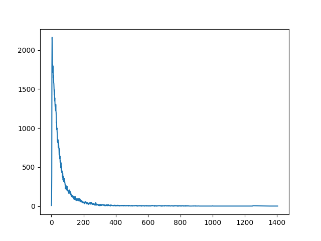

#Toxic Comment Classification Challenge

##比赛链接：
    https://www.kaggle.com/c/jigsaw-toxic-comment-classification-challenge

##训练数据总览

####1. 训练数据label的数量：训练数据总量为：95851条
        | toxic | severe_toxic | obscene | threat | insult | identity_hate  | normal |
        | 9237  | 965          |   5109  |   305  |  4765  |      814       | 86061  |

####2. 训练数据文本总览

 

####3. word2vec文件夹
使用英文wiki数据集（14G）训练word2vec文件。作为提前训练好的向量